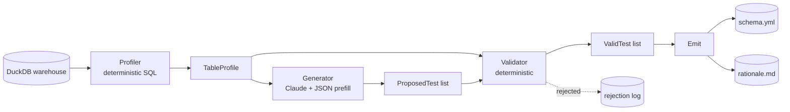

# Architecture

DQ Test Generator turns a warehouse table into a dbt test suite via a strict three-component pipeline. Profiling is deterministic, generation is the only LLM step, validation is deterministic. The same approach that powers Lineage Oracle's reliability claims (every answer cites a source) shows up here as: every emitted test is verified against the real schema before YAML is written.

## Pipeline

## Components

### `dqgen/profile.py` — Profiler

Pure SQL. Per table, runs ~5 query types:

| Query | Purpose |
|---|---|
| `information_schema.columns` | declared schema |
| `SELECT COUNT(*)` | row count |
| `COUNT(*) FILTER (WHERE col IS NULL), COUNT(DISTINCT col)` | per-column null + distinct counts |
| `MIN/MAX/AVG` | per-numeric-column stats |
| `SELECT col, COUNT(*) GROUP BY col ORDER BY 2 DESC LIMIT 5` | top-K for low-cardinality columns |

A column is "low-cardinality" when distinct count is ≤ 100 **and** the distinct/row ratio is ≤ 0.5.

### `dqgen/generator.py` — Generator (the only LLM step)

One Claude Sonnet 4.6 call per table. We pre-fill the assistant message with `[` to force the response into a JSON array; we stitch the prefill back on, parse the array, and convert each item into a `ProposedTest`. Malformed JSON returns an empty list — never partial output.

The system prompt enumerates exactly 5 supported test types. The user message contains the full profile as JSON.

No tools. No multi-turn. No agent loop. One profile in, one list of proposals out.

### `dqgen/validator.py` — Validator

Three checks per proposal:

1. **Column exists** — `proposal.column` is in the table's profile.
2. **Test name supported** — one of the 5 allowed names.
3. **Args valid** — `accepted_values` needs `values: list`; `accepted_range` needs at least one of `min_value` / `max_value`; `relationships` needs `to` and `field`.

Failures are returned with a reason so the CLI can show users what Claude tried and why it didn't make the cut.

### `dqgen/emit.py` — Emit

Pure formatting. Groups valid tests by column. Tests with no args render in dbt's short form (`- not_null`); tests with args render as a dict (`- accepted_values: {values: [...]}`). The rationale is a flat Markdown list of `column.test — rationale` lines.

## Key design choices

### Why JSON prefill instead of tool use?

Both work. Prefill is simpler (no tool plumbing), more debuggable (the LLM's output is plain text we can `print` and inspect), and equally reliable for a fixed-shape array output. Tool use becomes the right call when the LLM needs to perform multiple structured operations or query state — neither is happening here.

### Why no agent loop?

The task is one-shot: take a profile, return tests. There's no question to follow up on, no state to traverse. Adding a loop would be overhead with no signal benefit.

### Why DuckDB only for v1?

Profiling against `information_schema` is portable, but the eval harness loads CSVs directly into ephemeral DuckDBs. Supporting Snowflake / BigQuery for v1 would mean adding adapters, profile-time auth, and a way to seed evals against those engines. v2 territory.

### Why split validator from generator?

Determinism boundary. The validator is the only place we can guarantee "no broken YAML." Folding it into the generator would mix LLM output with the deterministic safety net — and a bug in the prompt would corrupt the safety net.

### Why fixture-based evals instead of LLM-as-judge?

The evals measure *real catch rate against known defects* — far more concrete than "did this answer look correct?" The fixture approach is reproducible, debuggable, and produces a metric we can publish on the README.
