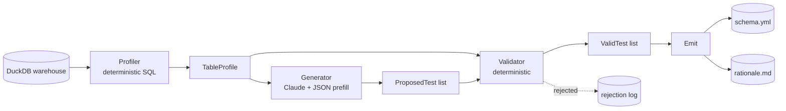

# DQ Test Generator Implementation Plan

> **For agentic workers:** REQUIRED SUB-SKILL: Use superpowers:subagent-driven-development (recommended) or superpowers:executing-plans to implement this plan task-by-task. Steps use checkbox (`- [ ]`) syntax for tracking.

**Goal:** Build a CLI tool that profiles a DuckDB warehouse table, asks Claude to propose dbt tests, validates the proposals, and emits a ready-to-commit `schema.yml` plus a per-test rationale.

**Architecture:** Three deterministic-where-possible components in a strict pipeline — `Profiler` (SQL only) → `Generator` (single Claude call with JSON-prefill) → `Validator` (deterministic) → `Emit` (JSON → YAML/Markdown). Eval harness measures real catch rate against fixture tables with planted bad rows.

**Tech Stack:** Python 3.11+, Anthropic SDK (Claude Sonnet 4.6), DuckDB, Pydantic v2, PyYAML, Typer, pytest, uv, ruff, hatchling.

---

## File Structure

```
dq-test-generator/
├── dqgen/
│   ├── __init__.py
│   ├── models.py                # Pydantic types (ColumnProfile, TableProfile, ProposedTest, ValidTest)
│   ├── profile.py               # SQL profiling (deterministic)
│   ├── generator.py             # Claude call + JSON prefill (only LLM step)
│   ├── validator.py             # column / test-name / args sanity
│   ├── emit.py                  # JSON → schema.yml + rationale.md
│   └── cli.py                   # Typer entry point
├── data/jaffle_shop/            # vendored demo dbt project + build script
├── evals/
│   ├── fixtures/
│   │   ├── orders/{clean.csv, dirty.csv, manifest.json}
│   │   ├── customers/{...}
│   │   └── payments/{...}
│   ├── conftest.py
│   └── test_evals.py
├── tests/                       # unit tests, mirrors dqgen/
├── pyproject.toml               # uv + ruff + hatchling
├── .env.example
├── .gitignore
├── README.md
└── docs/
    ├── ARCHITECTURE.md
    ├── EVALS.md
    └── superpowers/
        ├── specs/2026-05-06-dq-test-generator-design.md  (already written)
        └── plans/2026-05-06-dq-test-generator.md         (this file)
```

**Responsibility split:**
- `models.py` — pure types, no I/O
- `profile.py` — deterministic, no LLM, only DuckDB
- `generator.py` — only file that calls Claude
- `validator.py` — deterministic, no I/O
- `emit.py` — pure formatting
- `cli.py` — orchestration, no business logic

---

## Phase 0 — Project Setup

### Task 1: Initialize uv project

**Files:**
- Create: `pyproject.toml`
- Create: `.python-version`
- Create: `.env.example`
- Create: `oracle/__init__.py` (stub, for hatchling — will be replaced)
- Modify: `.gitignore` (already has `.superpowers/`)
- Create: `README.md` (stub)

- [ ] **Step 1: Confirm uv installed**

Run: `uv --version`
Expected: prints `uv 0.x.x`. If missing: `brew install uv`.

- [ ] **Step 2: Create `pyproject.toml`**

```toml
[project]
name = "dq-test-generator"
version = "0.1.0"
description = "Generate dbt tests for a warehouse table using Claude"
readme = "README.md"
requires-python = ">=3.11"
dependencies = [
    "anthropic>=0.40.0",
    "duckdb>=1.1.0",
    "pydantic>=2.9.0",
    "PyYAML>=6.0.2",
    "typer>=0.13.0",
    "python-dotenv>=1.0.0",
]

[project.scripts]
dq-gen = "dqgen.cli:app"

[build-system]
requires = ["hatchling"]
build-backend = "hatchling.build"

[tool.hatch.build.targets.wheel]
packages = ["dqgen"]

[dependency-groups]
dev = [
    "pytest>=8.3.0",
    "pytest-cov>=6.0.0",
    "ruff>=0.7.0",
]

[tool.ruff]
line-length = 100
target-version = "py311"

[tool.ruff.lint]
select = ["E", "F", "I", "B", "UP", "SIM"]

[tool.pytest.ini_options]
testpaths = ["tests", "evals"]
```

- [ ] **Step 3: Create `.python-version`**

```
3.11
```

- [ ] **Step 4: Create `.env.example`**

```
ANTHROPIC_API_KEY=sk-ant-...
```

- [ ] **Step 5: Append to `.gitignore`**

The current `.gitignore` already contains `.superpowers/`. Append:

```
.venv/
__pycache__/
*.pyc
.pytest_cache/
.ruff_cache/
.env
data/jaffle_shop/dbt_project/jaffle_shop.duckdb
data/jaffle_shop/dbt_project/target/
data/jaffle_shop/dbt_project/dbt_packages/
data/jaffle_shop/dbt_project/logs/
```

- [ ] **Step 6: Create `dqgen/__init__.py` (empty)**

```bash
mkdir -p dqgen
touch dqgen/__init__.py
```

- [ ] **Step 7: Create `README.md` stub**

```markdown
# DQ Test Generator

CLI tool that profiles a DuckDB warehouse table and asks Claude to propose dbt tests.

(Full README written in Task 13.)
```

- [ ] **Step 8: Sync dependencies**

Run: `uv sync`
Expected: creates `.venv/` and `uv.lock` cleanly. The `dq-gen` entry point won't be runnable yet (no `dqgen.cli` module) but the install should succeed.

- [ ] **Step 9: Commit**

```bash
git add pyproject.toml .python-version .env.example .gitignore dqgen/__init__.py README.md uv.lock
git -c user.name="Mona Alkhatib" -c user.email="muna.alkhateeb@gmail.com" commit -m "chore: initialize uv project with hatchling build backend"
```

---

### Task 2: Vendor jaffle_shop demo data

**Files:**
- Create: `data/jaffle_shop/dbt_project/` (copied from upstream)
- Create: `data/jaffle_shop/build_warehouse.py`

- [ ] **Step 1: Add dbt-duckdb to dev deps**

Run: `uv add --dev dbt-duckdb`
Expected: dependency added to `pyproject.toml` dev group, `uv.lock` updated.

- [ ] **Step 2: Clone jaffle_shop_duckdb**

Run:
```bash
git clone --depth 1 https://github.com/dbt-labs/jaffle_shop_duckdb.git /tmp/jaffle_shop_duckdb_dq
mkdir -p data/jaffle_shop
cp -R /tmp/jaffle_shop_duckdb/* data/jaffle_shop/dbt_project/
rm -rf data/jaffle_shop/dbt_project/.git
```
Expected: `data/jaffle_shop/dbt_project/dbt_project.yml` exists.

- [ ] **Step 3: Create `data/jaffle_shop/build_warehouse.py`**

```python
"""One-time setup: produce data/jaffle_shop/dbt_project/jaffle_shop.duckdb.

Run manually after cloning the repo:
    cd data/jaffle_shop/dbt_project
    dbt seed --profiles-dir .
    dbt run --profiles-dir .

The resulting jaffle_shop.duckdb is git-ignored.
"""
import subprocess
from pathlib import Path

PROJECT = Path(__file__).parent / "dbt_project"


def main():
    subprocess.run(["dbt", "seed", "--profiles-dir", "."], cwd=PROJECT, check=True)
    subprocess.run(["dbt", "run", "--profiles-dir", "."], cwd=PROJECT, check=True)


if __name__ == "__main__":
    main()
```

- [ ] **Step 4: Build the warehouse**

Run from project root:
```bash
cd data/jaffle_shop/dbt_project
../../../.venv/bin/dbt seed --profiles-dir .
../../../.venv/bin/dbt run --profiles-dir .
cd ../../..
```
Expected: `data/jaffle_shop/dbt_project/jaffle_shop.duckdb` exists (~1.5MB), seeds loaded (~312 rows), 5 models built.

- [ ] **Step 5: Commit (warehouse binary is gitignored)**

```bash
git add data/jaffle_shop/dbt_project data/jaffle_shop/build_warehouse.py pyproject.toml uv.lock
git -c user.name="Mona Alkhatib" -c user.email="muna.alkhateeb@gmail.com" commit -m "chore: vendor jaffle_shop demo warehouse"
```

---

## Phase 1 — Models & Profiler

### Task 3: Define Pydantic models

**Files:**
- Create: `dqgen/models.py`
- Create: `tests/__init__.py`
- Create: `tests/test_models.py`

- [ ] **Step 1: Write the failing test `tests/test_models.py`**

```python
import pytest
from pydantic import ValidationError

from dqgen.models import ColumnProfile, ProposedTest, TableProfile, ValidTest


def test_column_profile_basic():
    cp = ColumnProfile(
        name="user_id",
        dtype="INTEGER",
        nullable=False,
        null_count=0,
        distinct_count=100,
    )
    assert cp.name == "user_id"
    assert cp.distinct_to_row_ratio(row_count=100) == 1.0


def test_column_profile_top_values_optional():
    cp = ColumnProfile(name="x", dtype="VARCHAR", nullable=True, null_count=0, distinct_count=5)
    assert cp.top_values == []


def test_table_profile_aggregates_columns():
    tp = TableProfile(
        schema="raw",
        name="orders",
        row_count=100,
        columns=[
            ColumnProfile(name="id", dtype="INTEGER", nullable=False, null_count=0, distinct_count=100),
            ColumnProfile(name="status", dtype="VARCHAR", nullable=False, null_count=0, distinct_count=5),
        ],
    )
    assert tp.qualified_name == "raw.orders"
    assert tp.column("id").distinct_count == 100


def test_proposed_test_must_have_column_and_test():
    with pytest.raises(ValidationError):
        ProposedTest(test="not_null")  # missing column


def test_valid_test_inherits_proposed_fields():
    vt = ValidTest(column="x", test="not_null", args={}, rationale="declared NOT NULL")
    assert vt.column == "x"
```

- [ ] **Step 2: Run tests, verify they fail**

Run: `uv run pytest tests/test_models.py -v`
Expected: FAIL — module not found.

- [ ] **Step 3: Implement `dqgen/models.py`**

```python
"""Pydantic types used throughout the pipeline.

These types form the strict contract between profiler → generator →
validator → emit. Each stage takes one model in and returns another.
"""
from __future__ import annotations

from typing import Any

from pydantic import BaseModel, Field


class ColumnProfile(BaseModel):
    name: str
    dtype: str
    nullable: bool
    null_count: int
    distinct_count: int
    min_value: Any | None = None
    max_value: Any | None = None
    mean_value: float | None = None
    top_values: list[tuple[Any, int]] = Field(default_factory=list)

    def distinct_to_row_ratio(self, row_count: int) -> float:
        if row_count == 0:
            return 0.0
        return self.distinct_count / row_count


class TableProfile(BaseModel):
    schema: str
    name: str
    row_count: int
    columns: list[ColumnProfile]

    @property
    def qualified_name(self) -> str:
        return f"{self.schema}.{self.name}"

    def column(self, name: str) -> ColumnProfile:
        for c in self.columns:
            if c.name == name:
                return c
        raise KeyError(name)


class ProposedTest(BaseModel):
    column: str
    test: str
    args: dict[str, Any] = Field(default_factory=dict)
    rationale: str = ""


class ValidTest(ProposedTest):
    """A ProposedTest that has passed validation. Same fields, distinct type."""
```

- [ ] **Step 4: Create `tests/__init__.py`**

```bash
touch tests/__init__.py
```

- [ ] **Step 5: Run tests, verify they pass**

Run: `uv run pytest tests/test_models.py -v`
Expected: 5 passed.

- [ ] **Step 6: Commit**

```bash
git add dqgen/models.py tests/__init__.py tests/test_models.py
git -c user.name="Mona Alkhatib" -c user.email="muna.alkhateeb@gmail.com" commit -m "feat: add pipeline pydantic models"
```

---

### Task 4: Implement SQL profiler

**Files:**
- Create: `dqgen/profile.py`
- Create: `tests/test_profile.py`

- [ ] **Step 1: Write the failing test `tests/test_profile.py`**

```python
import duckdb
import pytest

from dqgen.profile import profile_table


@pytest.fixture
def warehouse(tmp_path):
    db = tmp_path / "wh.duckdb"
    con = duckdb.connect(str(db))
    con.execute("CREATE SCHEMA raw")
    con.execute(
        """
        CREATE TABLE raw.orders (
            id INTEGER NOT NULL,
            user_id INTEGER,
            status VARCHAR,
            amount DOUBLE
        )
        """
    )
    con.executemany(
        "INSERT INTO raw.orders VALUES (?, ?, ?, ?)",
        [
            (1, 10, "placed", 100.0),
            (2, 11, "placed", 50.0),
            (3, 12, "shipped", 200.0),
            (4, 13, "completed", 300.0),
            (5, None, "completed", 75.0),
        ],
    )
    con.close()
    return db


def test_profile_table_records_row_count(warehouse):
    p = profile_table(warehouse, "raw", "orders")
    assert p.row_count == 5


def test_profile_table_lists_columns(warehouse):
    p = profile_table(warehouse, "raw", "orders")
    names = {c.name for c in p.columns}
    assert names == {"id", "user_id", "status", "amount"}


def test_profile_table_records_null_counts(warehouse):
    p = profile_table(warehouse, "raw", "orders")
    user = p.column("user_id")
    assert user.null_count == 1
    id_col = p.column("id")
    assert id_col.null_count == 0


def test_profile_table_records_distinct_counts(warehouse):
    p = profile_table(warehouse, "raw", "orders")
    assert p.column("status").distinct_count == 3
    assert p.column("id").distinct_count == 5


def test_profile_table_records_numeric_minmax(warehouse):
    p = profile_table(warehouse, "raw", "orders")
    amount = p.column("amount")
    assert amount.min_value == 50.0
    assert amount.max_value == 300.0


def test_profile_table_records_top_values_for_low_cardinality(warehouse):
    p = profile_table(warehouse, "raw", "orders")
    status = p.column("status")
    # status has 3 distinct values across 5 rows: ratio = 0.6 — too high; should NOT have top_values.
    # But for this test, status's ratio is 3/5 = 0.6 > 0.5, so top_values stays empty.
    assert status.top_values == []


def test_profile_table_returns_top_values_when_truly_low_cardinality(tmp_path):
    db = tmp_path / "wh.duckdb"
    con = duckdb.connect(str(db))
    con.execute("CREATE SCHEMA s")
    con.execute("CREATE TABLE s.t (x VARCHAR)")
    # 100 rows, 3 distinct values → ratio 0.03, qualifies as low-cardinality.
    rows = [("a",)] * 60 + [("b",)] * 30 + [("c",)] * 10
    con.executemany("INSERT INTO s.t VALUES (?)", rows)
    con.close()

    p = profile_table(db, "s", "t")
    x = p.column("x")
    top = dict(x.top_values)
    assert top == {"a": 60, "b": 30, "c": 10}


def test_profile_table_unknown_table_raises(warehouse):
    with pytest.raises(ValueError, match="not found"):
        profile_table(warehouse, "raw", "nope")
```

- [ ] **Step 2: Run tests, verify they fail**

Run: `uv run pytest tests/test_profile.py -v`
Expected: FAIL — module not found.

- [ ] **Step 3: Implement `dqgen/profile.py`**

```python
"""Deterministic SQL profiling against a DuckDB warehouse.

The profile is the only thing the generator sees about the data. We
build it from a fixed set of queries:
- declared schema (information_schema.columns)
- row count
- per-column null count + distinct count
- per-numeric-column min/max/avg
- per-low-cardinality-column top-5 values

A column qualifies as low-cardinality when its distinct count is ≤ 100
AND distinct/row ratio is ≤ 0.5.
"""
from __future__ import annotations

from pathlib import Path
from typing import Any

import duckdb

from dqgen.models import ColumnProfile, TableProfile

NUMERIC_TYPES = {
    "TINYINT", "SMALLINT", "INTEGER", "BIGINT", "HUGEINT",
    "UTINYINT", "USMALLINT", "UINTEGER", "UBIGINT",
    "FLOAT", "DOUBLE", "DECIMAL",
}

LOW_CARDINALITY_DISTINCT_CAP = 100
LOW_CARDINALITY_RATIO_CAP = 0.5
TOP_K = 5


def _is_numeric(dtype: str) -> bool:
    base = dtype.split("(")[0].upper()
    return base in NUMERIC_TYPES


def _columns(con: duckdb.DuckDBPyConnection, schema: str, name: str) -> list[tuple[str, str, bool]]:
    rows = con.execute(
        """
        SELECT column_name, data_type, is_nullable
        FROM information_schema.columns
        WHERE table_schema = ? AND table_name = ?
        ORDER BY ordinal_position
        """,
        [schema, name],
    ).fetchall()
    return [(r[0], r[1], r[2] == "YES") for r in rows]


def _profile_column(
    con: duckdb.DuckDBPyConnection,
    schema: str,
    name: str,
    column: str,
    dtype: str,
    nullable: bool,
    row_count: int,
) -> ColumnProfile:
    qcol = f'"{column}"'
    qtable = f'"{schema}"."{name}"'

    null_count, distinct_count = con.execute(
        f"SELECT COUNT(*) FILTER (WHERE {qcol} IS NULL), COUNT(DISTINCT {qcol}) FROM {qtable}"
    ).fetchone()

    min_v: Any = None
    max_v: Any = None
    mean_v: float | None = None
    if _is_numeric(dtype):
        row = con.execute(
            f"SELECT MIN({qcol}), MAX({qcol}), AVG({qcol}) FROM {qtable}"
        ).fetchone()
        min_v, max_v, mean_v = row[0], row[1], (float(row[2]) if row[2] is not None else None)

    top_values: list[tuple[Any, int]] = []
    ratio = (distinct_count / row_count) if row_count else 0.0
    if (
        distinct_count > 0
        and distinct_count <= LOW_CARDINALITY_DISTINCT_CAP
        and ratio <= LOW_CARDINALITY_RATIO_CAP
    ):
        rows = con.execute(
            f"""
            SELECT {qcol}, COUNT(*) AS n
            FROM {qtable}
            WHERE {qcol} IS NOT NULL
            GROUP BY {qcol}
            ORDER BY n DESC, {qcol}
            LIMIT ?
            """,
            [TOP_K],
        ).fetchall()
        top_values = [(r[0], r[1]) for r in rows]

    return ColumnProfile(
        name=column,
        dtype=dtype,
        nullable=nullable,
        null_count=null_count,
        distinct_count=distinct_count,
        min_value=min_v,
        max_value=max_v,
        mean_value=mean_v,
        top_values=top_values,
    )


def profile_table(warehouse_path: Path, schema: str, name: str) -> TableProfile:
    con = duckdb.connect(str(warehouse_path), read_only=True)
    try:
        cols = _columns(con, schema, name)
        if not cols:
            raise ValueError(f"table not found: {schema}.{name}")

        row_count = con.execute(f'SELECT COUNT(*) FROM "{schema}"."{name}"').fetchone()[0]

        column_profiles = [
            _profile_column(con, schema, name, col, dtype, nullable, row_count)
            for col, dtype, nullable in cols
        ]

        return TableProfile(
            schema=schema,
            name=name,
            row_count=row_count,
            columns=column_profiles,
        )
    finally:
        con.close()
```

- [ ] **Step 4: Run tests, verify they pass**

Run: `uv run pytest tests/test_profile.py -v`
Expected: 8 passed.

- [ ] **Step 5: Commit**

```bash
git add dqgen/profile.py tests/test_profile.py
git -c user.name="Mona Alkhatib" -c user.email="muna.alkhateeb@gmail.com" commit -m "feat: add deterministic SQL profiler"
```

---

## Phase 2 — Generator (the only LLM step)

### Task 5: Implement Claude generator with JSON prefill

**Files:**
- Create: `dqgen/generator.py`
- Create: `tests/test_generator.py`

- [ ] **Step 1: Write the failing test `tests/test_generator.py`**

```python
import json
from unittest.mock import MagicMock

from dqgen.generator import generate_proposed_tests
from dqgen.models import ColumnProfile, TableProfile


def _profile() -> TableProfile:
    return TableProfile(
        schema="raw",
        name="orders",
        row_count=100,
        columns=[
            ColumnProfile(name="id", dtype="INTEGER", nullable=False, null_count=0, distinct_count=100),
            ColumnProfile(
                name="status",
                dtype="VARCHAR",
                nullable=False,
                null_count=0,
                distinct_count=3,
                top_values=[("placed", 60), ("shipped", 30), ("completed", 10)],
            ),
        ],
    )


def _claude_response(payload: list[dict]) -> MagicMock:
    """Build a fake Anthropic response whose content is the prefill continuation."""
    text_block = MagicMock(type="text", text=json.dumps(payload)[1:])  # drop leading '['
    response = MagicMock(content=[text_block])
    return response


def test_generate_returns_parsed_proposals():
    canned = [
        {"column": "id", "test": "not_null", "args": {}, "rationale": "PK, no nulls"},
        {"column": "id", "test": "unique", "args": {}, "rationale": "100 distinct of 100 rows"},
        {
            "column": "status",
            "test": "accepted_values",
            "args": {"values": ["placed", "shipped", "completed"]},
            "rationale": "3 stable values",
        },
    ]
    client = MagicMock()
    client.messages.create.return_value = _claude_response(canned)

    out = generate_proposed_tests(_profile(), client=client)

    assert [p.column for p in out] == ["id", "id", "status"]
    assert out[2].args["values"] == ["placed", "shipped", "completed"]


def test_generate_uses_assistant_prefill():
    client = MagicMock()
    client.messages.create.return_value = _claude_response([])

    generate_proposed_tests(_profile(), client=client)

    kwargs = client.messages.create.call_args.kwargs
    last_message = kwargs["messages"][-1]
    assert last_message["role"] == "assistant"
    assert last_message["content"] == "["


def test_generate_returns_empty_on_malformed_json():
    bad = MagicMock()
    bad.content = [MagicMock(type="text", text="not-json-at-all")]
    client = MagicMock()
    client.messages.create.return_value = bad

    out = generate_proposed_tests(_profile(), client=client)

    assert out == []
```

- [ ] **Step 2: Run tests, verify they fail**

Run: `uv run pytest tests/test_generator.py -v`
Expected: FAIL — module not found.

- [ ] **Step 3: Implement `dqgen/generator.py`**

```python
"""Single-turn structured generation of proposed dbt tests.

We send Claude the table profile and prefill the assistant turn with `[`
to force the response into a JSON array. We parse the array into
`ProposedTest` objects. No tools, no agent loop, no multi-turn — one
profile in, one list of proposals out.
"""
from __future__ import annotations

import json
from typing import Any

from pydantic import ValidationError

from dqgen.models import ProposedTest, TableProfile

MODEL = "claude-sonnet-4-6"
MAX_TOKENS = 4096

SYSTEM_PROMPT = """You are a senior data engineer specializing in dbt testing.

You receive a JSON profile of one warehouse table. You return a JSON
array of proposed dbt tests for the table.

Allowed test types (use exactly these names):
- "not_null"
- "unique"
- "accepted_values"        (args: {"values": [...]})
- "relationships"          (args: {"to": "ref('other_model')", "field": "id"})
- "dbt_utils.accepted_range" (args: {"min_value": ..., "max_value": ...})

Rules:
- Output ONLY a JSON array. No prose, no markdown, no code fences.
- Every proposal must reference a column that exists in the profile.
- Use rationale to briefly justify each test based on profile evidence
  (e.g. "0% nulls observed, distinct count equals row count → primary key").
- Don't propose redundant tests (e.g. unique + not_null + accepted_values
  on the same column when accepted_values is overkill).
- Don't propose relationships unless the column name strongly suggests
  a foreign key (ends in "_id" and the referenced table is plausible).
- Use ONLY literal scalar values for accepted_range bounds (e.g.
  "min_value": 0 or "max_value": "2030-12-31"). Do NOT use Jinja
  templates like "{{ run_started_at }}" — bounds must be directly
  comparable to the column at SQL evaluation time.

Schema for each element:
{
  "column": "<column name>",
  "test": "<one of the allowed test names>",
  "args": {<test-specific arguments, may be empty>},
  "rationale": "<one sentence>"
}
"""


def _profile_as_user_text(profile: TableProfile) -> str:
    return (
        f"Table: {profile.qualified_name}\n"
        f"Profile JSON:\n```json\n{profile.model_dump_json(indent=2)}\n```\n"
        "Return the JSON array of proposed tests now."
    )


def _parse_response_text(prefill: str, response_text: str) -> list[dict[str, Any]]:
    """Stitch the prefill back onto the response and parse as JSON."""
    full = prefill + response_text
    # Trim anything after the closing bracket of the top-level array.
    end = full.rfind("]")
    if end == -1:
        return []
    candidate = full[: end + 1]
    return json.loads(candidate)


def generate_proposed_tests(
    profile: TableProfile,
    *,
    client: Any,
    model: str = MODEL,
) -> list[ProposedTest]:
    user_text = _profile_as_user_text(profile)
    prefill = "["

    response = client.messages.create(
        model=model,
        max_tokens=MAX_TOKENS,
        system=SYSTEM_PROMPT,
        messages=[
            {"role": "user", "content": user_text},
            {"role": "assistant", "content": prefill},
        ],
    )
    text_blocks = [b.text for b in response.content if getattr(b, "type", None) == "text"]
    response_text = "".join(text_blocks)

    try:
        parsed = _parse_response_text(prefill, response_text)
    except json.JSONDecodeError:
        return []

    proposals: list[ProposedTest] = []
    for item in parsed:
        try:
            proposals.append(ProposedTest(**item))
        except (ValidationError, TypeError):
            continue
    return proposals
```

- [ ] **Step 4: Run tests, verify they pass**

Run: `uv run pytest tests/test_generator.py -v`
Expected: 3 passed.

- [ ] **Step 5: Commit**

```bash
git add dqgen/generator.py tests/test_generator.py
git -c user.name="Mona Alkhatib" -c user.email="muna.alkhateeb@gmail.com" commit -m "feat: add Claude generator with JSON prefill"
```

---

## Phase 3 — Validator

### Task 6: Implement deterministic validator

**Files:**
- Create: `dqgen/validator.py`
- Create: `tests/test_validator.py`

- [ ] **Step 1: Write the failing test `tests/test_validator.py`**

```python
from dqgen.models import ColumnProfile, ProposedTest, TableProfile
from dqgen.validator import validate_proposals


def _profile() -> TableProfile:
    return TableProfile(
        schema="raw",
        name="orders",
        row_count=100,
        columns=[
            ColumnProfile(name="id", dtype="INTEGER", nullable=False, null_count=0, distinct_count=100),
            ColumnProfile(name="status", dtype="VARCHAR", nullable=False, null_count=0, distinct_count=3),
        ],
    )


def test_validate_passes_well_formed_proposal():
    proposals = [ProposedTest(column="id", test="not_null", args={}, rationale="PK")]
    valid, rejected = validate_proposals(proposals, _profile())
    assert len(valid) == 1 and len(rejected) == 0


def test_validate_rejects_unknown_column():
    proposals = [ProposedTest(column="nope", test="not_null", args={}, rationale="...")]
    valid, rejected = validate_proposals(proposals, _profile())
    assert len(valid) == 0
    assert "column" in rejected[0].reason.lower()


def test_validate_rejects_unknown_test_name():
    proposals = [ProposedTest(column="id", test="frobnicate", args={}, rationale="...")]
    valid, rejected = validate_proposals(proposals, _profile())
    assert len(valid) == 0
    assert "test" in rejected[0].reason.lower()


def test_validate_rejects_accepted_values_without_values():
    proposals = [ProposedTest(column="status", test="accepted_values", args={}, rationale="...")]
    valid, rejected = validate_proposals(proposals, _profile())
    assert len(valid) == 0


def test_validate_accepts_accepted_values_with_values():
    proposals = [ProposedTest(
        column="status", test="accepted_values",
        args={"values": ["placed", "shipped", "completed"]},
        rationale="3 stable values",
    )]
    valid, rejected = validate_proposals(proposals, _profile())
    assert len(valid) == 1


def test_validate_rejects_accepted_range_without_bounds():
    proposals = [ProposedTest(column="id", test="dbt_utils.accepted_range", args={}, rationale="...")]
    valid, rejected = validate_proposals(proposals, _profile())
    assert len(valid) == 0


def test_validate_accepts_accepted_range_with_min_only():
    proposals = [ProposedTest(
        column="id", test="dbt_utils.accepted_range",
        args={"min_value": 0}, rationale="non-negative",
    )]
    valid, rejected = validate_proposals(proposals, _profile())
    assert len(valid) == 1


def test_validate_rejects_relationships_without_to_and_field():
    proposals = [ProposedTest(
        column="id", test="relationships", args={"to": "ref('users')"}, rationale="...",
    )]
    valid, rejected = validate_proposals(proposals, _profile())
    assert len(valid) == 0
```

- [ ] **Step 2: Run tests, verify they fail**

Run: `uv run pytest tests/test_validator.py -v`
Expected: FAIL — module not found.

- [ ] **Step 3: Implement `dqgen/validator.py`**

```python
"""Deterministic validation of LLM-proposed tests.

Three checks per proposal:
1. Column exists in the profile.
2. Test name is one we support.
3. Test-specific args are well-formed.

Failed proposals are returned with a human-readable reason so users
can see what Claude tried.
"""
from __future__ import annotations

from dataclasses import dataclass

from dqgen.models import ProposedTest, TableProfile, ValidTest

SUPPORTED_TESTS = {
    "not_null",
    "unique",
    "accepted_values",
    "relationships",
    "dbt_utils.accepted_range",
}


@dataclass
class RejectedTest:
    proposal: ProposedTest
    reason: str


def _check_args(proposal: ProposedTest) -> str | None:
    """Return reason string if args are invalid, else None."""
    args = proposal.args
    if proposal.test == "accepted_values":
        values = args.get("values")
        if not isinstance(values, list) or not values:
            return "accepted_values requires non-empty 'values' list"
    elif proposal.test == "dbt_utils.accepted_range":
        if "min_value" not in args and "max_value" not in args:
            return "accepted_range requires 'min_value' and/or 'max_value'"
    elif proposal.test == "relationships":
        if "to" not in args or "field" not in args:
            return "relationships requires 'to' and 'field'"
    return None


def validate_proposals(
    proposals: list[ProposedTest],
    profile: TableProfile,
) -> tuple[list[ValidTest], list[RejectedTest]]:
    column_names = {c.name for c in profile.columns}
    valid: list[ValidTest] = []
    rejected: list[RejectedTest] = []

    for p in proposals:
        if p.column not in column_names:
            rejected.append(RejectedTest(p, f"column '{p.column}' not in table"))
            continue
        if p.test not in SUPPORTED_TESTS:
            rejected.append(RejectedTest(p, f"unsupported test '{p.test}'"))
            continue
        arg_error = _check_args(p)
        if arg_error:
            rejected.append(RejectedTest(p, arg_error))
            continue
        valid.append(ValidTest(**p.model_dump()))

    return valid, rejected
```

- [ ] **Step 4: Run tests, verify they pass**

Run: `uv run pytest tests/test_validator.py -v`
Expected: 8 passed.

- [ ] **Step 5: Commit**

```bash
git add dqgen/validator.py tests/test_validator.py
git -c user.name="Mona Alkhatib" -c user.email="muna.alkhateeb@gmail.com" commit -m "feat: add deterministic validator"
```

---

## Phase 4 — Emit (JSON → schema.yml + rationale.md)

### Task 7: Implement YAML + Markdown emission

**Files:**
- Create: `dqgen/emit.py`
- Create: `tests/test_emit.py`

- [ ] **Step 1: Write the failing test `tests/test_emit.py`**

```python
import yaml

from dqgen.emit import emit_rationale, emit_schema_yaml
from dqgen.models import ValidTest


def _tests() -> list[ValidTest]:
    return [
        ValidTest(column="id", test="not_null", args={}, rationale="PK, no nulls"),
        ValidTest(column="id", test="unique", args={}, rationale="distinct == rows"),
        ValidTest(
            column="status",
            test="accepted_values",
            args={"values": ["a", "b"]},
            rationale="2 distinct values",
        ),
    ]


def test_emit_schema_yaml_is_parseable():
    out = emit_schema_yaml(model_name="orders", tests=_tests())
    parsed = yaml.safe_load(out)
    assert parsed["version"] == 2
    assert parsed["models"][0]["name"] == "orders"


def test_emit_schema_yaml_groups_tests_per_column():
    out = emit_schema_yaml(model_name="orders", tests=_tests())
    parsed = yaml.safe_load(out)
    cols = {c["name"]: c for c in parsed["models"][0]["columns"]}
    assert set(cols["id"]["tests"]) == {"not_null", "unique"}


def test_emit_schema_yaml_uses_dict_form_for_parametrized_tests():
    out = emit_schema_yaml(model_name="orders", tests=_tests())
    parsed = yaml.safe_load(out)
    status = next(c for c in parsed["models"][0]["columns"] if c["name"] == "status")
    accepted = status["tests"][0]
    assert "accepted_values" in accepted
    assert accepted["accepted_values"]["values"] == ["a", "b"]


def test_emit_rationale_lists_one_line_per_test():
    out = emit_rationale(_tests())
    lines = [line for line in out.splitlines() if line.strip()]
    assert len(lines) >= 3
    assert any("id.not_null" in line for line in lines)
    assert any("PK, no nulls" in line for line in lines)
```

- [ ] **Step 2: Run tests, verify they fail**

Run: `uv run pytest tests/test_emit.py -v`
Expected: FAIL — module not found.

- [ ] **Step 3: Implement `dqgen/emit.py`**

```python
"""Emit dbt schema.yml and a per-test Markdown rationale.

Tests with no args render in dbt's short form (just the test name).
Tests with args render in the dict form ({test_name: {args...}}).
"""
from __future__ import annotations

from collections import defaultdict
from typing import Any

import yaml

from dqgen.models import ValidTest


def _test_yaml(test: ValidTest) -> str | dict[str, dict[str, Any]]:
    if not test.args:
        return test.test
    return {test.test: dict(test.args)}


def emit_schema_yaml(*, model_name: str, tests: list[ValidTest]) -> str:
    by_column: dict[str, list[ValidTest]] = defaultdict(list)
    for t in tests:
        by_column[t.column].append(t)

    columns_block = [
        {"name": col, "tests": [_test_yaml(t) for t in col_tests]}
        for col, col_tests in by_column.items()
    ]

    doc = {
        "version": 2,
        "models": [
            {
                "name": model_name,
                "columns": columns_block,
            }
        ],
    }
    return yaml.safe_dump(doc, sort_keys=False, default_flow_style=False)


def emit_rationale(tests: list[ValidTest]) -> str:
    lines = ["# DQ test rationale", ""]
    for t in tests:
        lines.append(f"- **{t.column}.{t.test}** — {t.rationale}")
    return "\n".join(lines) + "\n"
```

- [ ] **Step 4: Run tests, verify they pass**

Run: `uv run pytest tests/test_emit.py -v`
Expected: 4 passed.

- [ ] **Step 5: Commit**

```bash
git add dqgen/emit.py tests/test_emit.py
git -c user.name="Mona Alkhatib" -c user.email="muna.alkhateeb@gmail.com" commit -m "feat: emit schema.yml and rationale.md"
```

---

## Phase 5 — CLI

### Task 8: Wire the Typer CLI

**Files:**
- Create: `dqgen/cli.py`
- Create: `tests/test_cli.py`

- [ ] **Step 1: Write the failing test `tests/test_cli.py`**

```python
from typer.testing import CliRunner

from dqgen.cli import app

runner = CliRunner()


def test_cli_help_lists_command():
    result = runner.invoke(app, ["--help"])
    assert result.exit_code == 0
    assert "generate" in result.stdout.lower()
```

- [ ] **Step 2: Run, verify failure**

Run: `uv run pytest tests/test_cli.py -v`
Expected: FAIL — module not found.

- [ ] **Step 3: Implement `dqgen/cli.py`**

```python
"""Typer CLI entry point.

One command: `dq-gen generate --warehouse <db> --table <schema.name>`.
Pipes schema.yml to stdout, rationale.md to stderr (so you can pipe just
the YAML into a file).
"""
from __future__ import annotations

import os
import sys
from pathlib import Path

import typer
from dotenv import load_dotenv

app = typer.Typer(no_args_is_help=True)


@app.command()
def generate(
    table: str = typer.Option(..., help="Qualified table name: schema.name"),
    warehouse: Path = typer.Option(..., help="Path to the DuckDB warehouse"),
) -> None:
    """Profile a table, generate dbt tests, emit schema.yml to stdout."""
    load_dotenv()

    if "." not in table:
        typer.echo(f"--table must be qualified (schema.name), got: {table}", err=True)
        raise typer.Exit(2)
    schema, name = table.split(".", 1)

    import anthropic

    from dqgen.emit import emit_rationale, emit_schema_yaml
    from dqgen.generator import generate_proposed_tests
    from dqgen.profile import profile_table
    from dqgen.validator import validate_proposals

    typer.echo(f"Profiling {table}...", err=True)
    profile = profile_table(warehouse, schema, name)

    typer.echo(f"Calling Claude...", err=True)
    client = anthropic.Anthropic(api_key=os.environ["ANTHROPIC_API_KEY"])
    proposals = generate_proposed_tests(profile, client=client)

    typer.echo(f"Validating {len(proposals)} proposals...", err=True)
    valid, rejected = validate_proposals(proposals, profile)

    if rejected:
        typer.echo(f"Rejected {len(rejected)} proposal(s):", err=True)
        for r in rejected:
            typer.echo(f"  - {r.proposal.column}.{r.proposal.test}: {r.reason}", err=True)

    yaml_text = emit_schema_yaml(model_name=name, tests=valid)
    rationale_text = emit_rationale(valid)

    sys.stdout.write(yaml_text)
    sys.stderr.write("\n--- rationale ---\n")
    sys.stderr.write(rationale_text)
```

- [ ] **Step 4: Run tests, verify pass**

Run: `uv run pytest tests/test_cli.py -v`
Expected: 1 passed.

- [ ] **Step 5: Confirm CLI loads and shows help**

Run: `uv run dq-gen --help`
Expected: shows `generate` subcommand with `--table` and `--warehouse` options.

- [ ] **Step 6: Run full unit test suite**

Run: `uv run pytest -v`
Expected: ≥ 27 tests passing (5 + 8 + 3 + 8 + 4 + 1 — adjust if count differs).

- [ ] **Step 7: Commit**

```bash
git add dqgen/cli.py tests/test_cli.py
git -c user.name="Mona Alkhatib" -c user.email="muna.alkhateeb@gmail.com" commit -m "feat: wire Typer CLI with generate command"
```

---

## Phase 6 — Eval Fixtures

### Task 9: Build the `orders` eval fixture

**Files:**
- Create: `evals/fixtures/orders/clean.csv`
- Create: `evals/fixtures/orders/dirty.csv`
- Create: `evals/fixtures/orders/manifest.json`

- [ ] **Step 1: Create `evals/fixtures/orders/clean.csv`**

```csv
id,user_id,status,amount,order_date
1,10,placed,100.00,2025-01-01
2,11,shipped,50.00,2025-01-02
3,12,completed,200.00,2025-01-03
4,13,returned,75.00,2025-01-04
5,14,return_pending,30.00,2025-01-05
6,15,placed,150.00,2025-01-06
7,16,shipped,80.00,2025-01-07
8,17,completed,250.00,2025-01-08
9,18,placed,90.00,2025-01-09
10,19,completed,120.00,2025-01-10
```

- [ ] **Step 2: Create `evals/fixtures/orders/dirty.csv`**

(Same 10 rows as clean.csv plus 5 deliberately bad rows)

```csv
id,user_id,status,amount,order_date
1,10,placed,100.00,2025-01-01
2,11,shipped,50.00,2025-01-02
3,12,completed,200.00,2025-01-03
4,13,returned,75.00,2025-01-04
5,14,return_pending,30.00,2025-01-05
6,15,placed,150.00,2025-01-06
7,16,shipped,80.00,2025-01-07
8,17,completed,250.00,2025-01-08
9,18,placed,90.00,2025-01-09
10,19,completed,120.00,2025-01-10
1,20,placed,100.00,2025-01-11
11,21,unknown_status,75.00,2025-01-12
12,22,placed,-50.00,2025-01-13
13,,shipped,200.00,2025-01-14
14,23,completed,100.00,2099-12-31
```

- [ ] **Step 3: Create `evals/fixtures/orders/manifest.json`**

```json
{
  "table": "orders",
  "row_count_clean": 10,
  "row_count_dirty": 15,
  "defects": [
    {"row_index": 11, "column": "id", "violation": "duplicate", "expected_test": "unique"},
    {"row_index": 12, "column": "status", "violation": "unknown_value", "expected_test": "accepted_values"},
    {"row_index": 13, "column": "amount", "violation": "negative", "expected_test": "dbt_utils.accepted_range"},
    {"row_index": 14, "column": "user_id", "violation": "null", "expected_test": "not_null"},
    {"row_index": 15, "column": "order_date", "violation": "future", "expected_test": "dbt_utils.accepted_range"}
  ]
}
```

- [ ] **Step 4: Commit**

```bash
git add evals/fixtures/orders
git -c user.name="Mona Alkhatib" -c user.email="muna.alkhateeb@gmail.com" commit -m "feat: add orders eval fixture"
```

---

### Task 10: Build the `customers` eval fixture

**Files:**
- Create: `evals/fixtures/customers/clean.csv`
- Create: `evals/fixtures/customers/dirty.csv`
- Create: `evals/fixtures/customers/manifest.json`

- [ ] **Step 1: Create `evals/fixtures/customers/clean.csv`**

```csv
customer_id,email,signup_country,age
1,a@example.com,US,30
2,b@example.com,JP,25
3,c@example.com,DE,40
4,d@example.com,FR,35
5,e@example.com,US,28
6,f@example.com,JP,45
7,g@example.com,US,33
8,h@example.com,DE,22
9,i@example.com,FR,50
10,j@example.com,US,29
```

- [ ] **Step 2: Create `evals/fixtures/customers/dirty.csv`**

```csv
customer_id,email,signup_country,age
1,a@example.com,US,30
2,b@example.com,JP,25
3,c@example.com,DE,40
4,d@example.com,FR,35
5,e@example.com,US,28
6,f@example.com,JP,45
7,g@example.com,US,33
8,h@example.com,DE,22
9,i@example.com,FR,50
10,j@example.com,US,29
,k@example.com,US,30
11,a@example.com,US,30
12,l@example.com,US,-5
13,m@example.com,US,200
```

- [ ] **Step 3: Create `evals/fixtures/customers/manifest.json`**

```json
{
  "table": "customers",
  "row_count_clean": 10,
  "row_count_dirty": 14,
  "defects": [
    {"row_index": 11, "column": "customer_id", "violation": "null", "expected_test": "not_null"},
    {"row_index": 12, "column": "email", "violation": "duplicate", "expected_test": "unique"},
    {"row_index": 13, "column": "age", "violation": "negative", "expected_test": "dbt_utils.accepted_range"},
    {"row_index": 14, "column": "age", "violation": "out_of_range", "expected_test": "dbt_utils.accepted_range"}
  ]
}
```

- [ ] **Step 4: Commit**

```bash
git add evals/fixtures/customers
git -c user.name="Mona Alkhatib" -c user.email="muna.alkhateeb@gmail.com" commit -m "feat: add customers eval fixture"
```

---

### Task 11: Build the `payments` eval fixture

**Files:**
- Create: `evals/fixtures/payments/clean.csv`
- Create: `evals/fixtures/payments/dirty.csv`
- Create: `evals/fixtures/payments/manifest.json`

- [ ] **Step 1: Create `evals/fixtures/payments/clean.csv`**

```csv
payment_id,order_id,method,amount_cents
1,1,credit_card,10000
2,2,credit_card,5000
3,3,bank_transfer,20000
4,4,credit_card,7500
5,5,gift_card,3000
6,6,credit_card,15000
7,7,credit_card,8000
8,8,bank_transfer,25000
9,9,credit_card,9000
10,10,credit_card,12000
```

- [ ] **Step 2: Create `evals/fixtures/payments/dirty.csv`**

```csv
payment_id,order_id,method,amount_cents
1,1,credit_card,10000
2,2,credit_card,5000
3,3,bank_transfer,20000
4,4,credit_card,7500
5,5,gift_card,3000
6,6,credit_card,15000
7,7,credit_card,8000
8,8,bank_transfer,25000
9,9,credit_card,9000
10,10,credit_card,12000
1,11,credit_card,10000
11,12,crypto,5000
12,13,credit_card,-100
13,14,credit_card,99999999
```

- [ ] **Step 3: Create `evals/fixtures/payments/manifest.json`**

```json
{
  "table": "payments",
  "row_count_clean": 10,
  "row_count_dirty": 14,
  "defects": [
    {"row_index": 11, "column": "payment_id", "violation": "duplicate", "expected_test": "unique"},
    {"row_index": 12, "column": "method", "violation": "unknown_value", "expected_test": "accepted_values"},
    {"row_index": 13, "column": "amount_cents", "violation": "negative", "expected_test": "dbt_utils.accepted_range"},
    {"row_index": 14, "column": "amount_cents", "violation": "out_of_range", "expected_test": "dbt_utils.accepted_range"}
  ]
}
```

- [ ] **Step 4: Commit**

```bash
git add evals/fixtures/payments
git -c user.name="Mona Alkhatib" -c user.email="muna.alkhateeb@gmail.com" commit -m "feat: add payments eval fixture"
```

---

## Phase 7 — Eval Harness

### Task 12: Build the pytest eval runner

**Files:**
- Create: `evals/__init__.py`
- Create: `evals/conftest.py`
- Create: `evals/test_evals.py`

- [ ] **Step 1: Create `evals/__init__.py`**

```bash
touch evals/__init__.py
```

- [ ] **Step 2: Create `evals/conftest.py`**

```python
"""Shared helpers for the eval harness."""
from __future__ import annotations

import csv
import json
import os
from pathlib import Path

from dotenv import load_dotenv

load_dotenv()

FIXTURES_DIR = Path(__file__).parent / "fixtures"
HAS_KEY = bool(os.environ.get("ANTHROPIC_API_KEY"))


def fixture_dirs() -> list[Path]:
    return sorted(p for p in FIXTURES_DIR.iterdir() if p.is_dir())


def load_manifest(fixture: Path) -> dict:
    return json.loads((fixture / "manifest.json").read_text())


def load_csv(path: Path) -> tuple[list[str], list[list[str]]]:
    with path.open() as f:
        reader = csv.reader(f)
        header = next(reader)
        rows = list(reader)
    return header, rows
```

- [ ] **Step 3: Create `evals/test_evals.py`**

```python
"""Eval harness: catch-rate / false-positive tests against fixture tables.

For each fixture:
1. Load clean CSV into an ephemeral DuckDB.
2. Run the generator → validator → emit pipeline.
3. Run the generated tests against clean — expect zero failures (no false positives).
4. Run the generated tests against dirty — record which planted defects were caught.
5. Assert catch_rate >= 0.80 and false_positives == 0.

Skipped automatically when ANTHROPIC_API_KEY is not set so unit-test runs
don't pay for API calls.
"""
from __future__ import annotations

import os
from pathlib import Path

import duckdb
import pytest

from dqgen.generator import generate_proposed_tests
from dqgen.profile import profile_table
from dqgen.validator import validate_proposals
from evals.conftest import HAS_KEY, fixture_dirs, load_csv, load_manifest

CATCH_RATE_THRESHOLD = 0.80


def _load_csv_into_duckdb(db: Path, schema: str, table: str, csv_path: Path) -> None:
    con = duckdb.connect(str(db))
    con.execute(f"CREATE SCHEMA IF NOT EXISTS {schema}")
    con.execute(
        f"CREATE TABLE {schema}.{table} AS SELECT * FROM read_csv_auto('{csv_path}', header=True)"
    )
    con.close()


def _run_test_against(db: Path, schema: str, table: str, vt) -> int:
    """Return number of rows the test catches (i.e. failing rows)."""
    con = duckdb.connect(str(db), read_only=True)
    qt = f'"{schema}"."{table}"'
    qc = f'"{vt.column}"'
    try:
        if vt.test == "not_null":
            sql = f"SELECT COUNT(*) FROM {qt} WHERE {qc} IS NULL"
        elif vt.test == "unique":
            sql = (
                f"SELECT COALESCE(SUM(c - 1), 0) FROM "
                f"(SELECT COUNT(*) AS c FROM {qt} WHERE {qc} IS NOT NULL GROUP BY {qc} HAVING COUNT(*) > 1) sub"
            )
        elif vt.test == "accepted_values":
            values = vt.args["values"]
            placeholders = ", ".join("?" for _ in values)
            sql = (
                f"SELECT COUNT(*) FROM {qt} "
                f"WHERE {qc} IS NOT NULL AND {qc} NOT IN ({placeholders})"
            )
            return con.execute(sql, values).fetchone()[0]
        elif vt.test == "dbt_utils.accepted_range":
            clauses = []
            params: list = []
            if "min_value" in vt.args:
                clauses.append(f"{qc} < ?")
                params.append(vt.args["min_value"])
            if "max_value" in vt.args:
                clauses.append(f"{qc} > ?")
                params.append(vt.args["max_value"])
            sql = f"SELECT COUNT(*) FROM {qt} WHERE {qc} IS NOT NULL AND ({' OR '.join(clauses)})"
            return con.execute(sql, params).fetchone()[0]
        elif vt.test == "relationships":
            # Skip relationships in eval harness — fixtures are single-table.
            return 0
        else:
            return 0
        return con.execute(sql).fetchone()[0]
    finally:
        con.close()


@pytest.mark.skipif(not HAS_KEY, reason="ANTHROPIC_API_KEY not configured")
@pytest.mark.parametrize("fixture", fixture_dirs(), ids=lambda p: p.name)
def test_fixture(fixture: Path, tmp_path: Path):
    import anthropic

    manifest = load_manifest(fixture)
    table = manifest["table"]
    schema = "test"

    clean_db = tmp_path / "clean.duckdb"
    dirty_db = tmp_path / "dirty.duckdb"
    _load_csv_into_duckdb(clean_db, schema, table, fixture / "clean.csv")
    _load_csv_into_duckdb(dirty_db, schema, table, fixture / "dirty.csv")

    profile = profile_table(clean_db, schema, table)
    client = anthropic.Anthropic(api_key=os.environ["ANTHROPIC_API_KEY"])
    proposals = generate_proposed_tests(profile, client=client)
    valid, _ = validate_proposals(proposals, profile)

    # 1) False-positive check: tests must pass on clean data.
    fp_failures = sum(_run_test_against(clean_db, schema, table, vt) for vt in valid)
    assert fp_failures == 0, f"{fixture.name}: {fp_failures} false positive(s) on clean data"

    # 2) Catch-rate check: count caught defects.
    defects = manifest["defects"]
    caught = 0
    for defect in defects:
        for vt in valid:
            if vt.column != defect["column"]:
                continue
            if vt.test != defect["expected_test"]:
                continue
            if _run_test_against(dirty_db, schema, table, vt) > 0:
                caught += 1
                break

    catch_rate = caught / len(defects)
    assert catch_rate >= CATCH_RATE_THRESHOLD, (
        f"{fixture.name}: catch rate {catch_rate:.2f} below {CATCH_RATE_THRESHOLD}\n"
        f"  defects: {len(defects)}, caught: {caught}\n"
        f"  generated tests: {[(t.column, t.test) for t in valid]}"
    )
```

- [ ] **Step 4: Verify collection (no API keys → skipped)**

Run: `uv run pytest evals/ --collect-only -q`
Expected: collects 3 fixtures (one parametrized case each).

Then: `uv run pytest -v`
Expected: ~28 unit tests passing, 3 evals skipped.

- [ ] **Step 5: Commit**

```bash
git add evals/__init__.py evals/conftest.py evals/test_evals.py
git -c user.name="Mona Alkhatib" -c user.email="muna.alkhateeb@gmail.com" commit -m "feat: add pytest eval harness with catch-rate and false-positive checks"
```

---

## Phase 8 — Polish & Ship

### Task 13: Write the README

**Files:**
- Modify: `README.md`

- [ ] **Step 1: Replace the README stub with the full text**

```markdown
# DQ Test Generator

CLI tool that profiles a DuckDB warehouse table and asks Claude to propose dbt tests, then validates and emits a ready-to-commit `schema.yml` plus a per-test rationale.

> *"Point me at `raw.orders` and tell me which tests catch real bad rows."*

## What it does

1. **Profiles** the table — runs ~5 deterministic SQL queries to capture row count, null rates, distinct counts, numeric ranges, top values for low-cardinality columns.
2. **Asks Claude** for proposed dbt tests in a single call. Claude receives the profile and returns a JSON array of test proposals with rationales.
3. **Validates** every proposal — column must exist, test name must be supported, args must be well-formed. Bad proposals are dropped (and printed) so the YAML is never broken.
4. **Emits** a `schema.yml` to stdout and a `rationale.md` to stderr.

Supported test types:
- `not_null`, `unique`, `accepted_values`, `relationships` (built-in)
- `dbt_utils.accepted_range` (numeric ranges)

## Quickstart

```bash
# 1. Install
uv sync

# 2. Configure API key
cp .env.example .env
# Edit .env to add ANTHROPIC_API_KEY

# 3. Build the demo warehouse
cd data/jaffle_shop/dbt_project
dbt seed --profiles-dir . && dbt run --profiles-dir .
cd ../../..

# 4. Generate tests for one table
uv run dq-gen generate \
  --warehouse data/jaffle_shop/dbt_project/jaffle_shop.duckdb \
  --table main.raw_orders \
  > raw_orders_schema.yml
```

## Eval results

The eval harness loads each fixture into an ephemeral DuckDB, runs the
full pipeline, and asserts:

- **Catch rate ≥ 0.80** — fraction of planted defects caught
- **False positives = 0** — generated tests must pass on clean data

```bash
uv run pytest evals/ -v
```

(Skipped automatically when `ANTHROPIC_API_KEY` is not set.)

## Documentation

- [`docs/ARCHITECTURE.md`](docs/ARCHITECTURE.md) — the three-component pipeline + design choices
- [`docs/EVALS.md`](docs/EVALS.md) — eval harness format, metrics, fixture authoring
- [`docs/superpowers/specs/2026-05-06-dq-test-generator-design.md`](docs/superpowers/specs/2026-05-06-dq-test-generator-design.md) — full spec
- [`docs/superpowers/plans/2026-05-06-dq-test-generator.md`](docs/superpowers/plans/2026-05-06-dq-test-generator.md) — implementation plan

## Tech stack

- **LLM:** Claude Sonnet 4.6 (Anthropic SDK, single-turn JSON via assistant prefill)
- **Profiling / runtime:** DuckDB
- **Types:** Pydantic v2
- **YAML:** PyYAML
- **CLI:** Typer
- **Tests:** pytest
```

- [ ] **Step 2: Commit**

```bash
git add README.md
git -c user.name="Mona Alkhatib" -c user.email="muna.alkhateeb@gmail.com" commit -m "docs: write full README"
```

---

### Task 14: Write `docs/ARCHITECTURE.md`

**Files:**
- Create: `docs/ARCHITECTURE.md`

- [ ] **Step 1: Write the architecture doc**

```markdown
# Architecture

DQ Test Generator turns a warehouse table into a dbt test suite via a strict three-component pipeline. Profiling is deterministic, generation is the only LLM step, validation is deterministic. The same approach that powers Lineage Oracle's reliability claims (every answer cites a source) shows up here as: every emitted test is verified against the real schema before YAML is written.

## Pipeline



## Components

### `dqgen/profile.py` — Profiler

Pure SQL. Per table, runs ~5 query types:

| Query | Purpose |
|---|---|
| `information_schema.columns` | declared schema |
| `SELECT COUNT(*)` | row count |
| `COUNT(*) FILTER (WHERE col IS NULL), COUNT(DISTINCT col)` | per-column null + distinct counts |
| `MIN/MAX/AVG` | per-numeric-column stats |
| `SELECT col, COUNT(*) GROUP BY col ORDER BY 2 DESC LIMIT 5` | top-K for low-cardinality columns |

A column is "low-cardinality" when distinct count is ≤ 100 **and** the distinct/row ratio is ≤ 0.5.

### `dqgen/generator.py` — Generator (the only LLM step)

One Claude Sonnet 4.6 call per table. We pre-fill the assistant message with `[` to force the response into a JSON array; we stitch the prefill back on, parse the array, and convert each item into a `ProposedTest`. Malformed JSON returns an empty list — never partial output.

The system prompt enumerates exactly 5 supported test types. The user message contains the full profile as JSON.

No tools. No multi-turn. No agent loop. One profile in, one list of proposals out.

### `dqgen/validator.py` — Validator

Three checks per proposal:

1. **Column exists** — `proposal.column` is in the table's profile.
2. **Test name supported** — one of the 5 allowed names.
3. **Args valid** — `accepted_values` needs `values: list`; `accepted_range` needs at least one of `min_value` / `max_value`; `relationships` needs `to` and `field`.

Failures are returned with a reason so the CLI can show users what Claude tried and why it didn't make the cut.

### `dqgen/emit.py` — Emit

Pure formatting. Groups valid tests by column. Tests with no args render in dbt's short form (`- not_null`); tests with args render as a dict (`- accepted_values: {values: [...]}`). The rationale is a flat Markdown list of `column.test — rationale` lines.

## Key design choices

### Why JSON prefill instead of tool use?

Both work. Prefill is simpler (no tool plumbing), more debuggable (the LLM's output is plain text we can `print` and inspect), and equally reliable for a fixed-shape array output. Tool use becomes the right call when the LLM needs to perform multiple structured operations or query state — neither is happening here.

### Why no agent loop?

The task is one-shot: take a profile, return tests. There's no question to follow up on, no state to traverse. Adding a loop would be overhead with no signal benefit.

### Why DuckDB only for v1?

Profiling against `information_schema` is portable, but the eval harness loads CSVs directly into ephemeral DuckDBs. Supporting Snowflake / BigQuery for v1 would mean adding adapters, profile-time auth, and a way to seed evals against those engines. v2 territory.

### Why split validator from generator?

Determinism boundary. The validator is the only place we can guarantee "no broken YAML." Folding it into the generator would mix LLM output with the deterministic safety net — and a bug in the prompt would corrupt the safety net.

### Why fixture-based evals instead of LLM-as-judge?

The evals measure *real catch rate against known defects* — far more concrete than "did this answer look correct?" The fixture approach is reproducible, debuggable, and produces a metric we can publish on the README.
```

- [ ] **Step 2: Commit**

```bash
git add docs/ARCHITECTURE.md
git -c user.name="Mona Alkhatib" -c user.email="muna.alkhateeb@gmail.com" commit -m "docs: add ARCHITECTURE.md"
```

---

### Task 15: Write `docs/EVALS.md`

**Files:**
- Create: `docs/EVALS.md`

- [ ] **Step 1: Write the evals doc**

```markdown
# Eval Harness

The eval harness is what turns DQ Test Generator from a *demo that produces plausible YAML* into a *system that catches real bugs*. Each fixture is a known-bad-rows experiment.

## Why this approach

Most LLM-output evals score "did the answer look correct?" — substring matches, BLEU, an LLM judge. That's fine for free-form text; it's the wrong tool for code generation where there's a ground truth (does the test actually catch the bad row?). We can run the generated SQL and observe whether it fires on the planted defects.

This eval design also exposes failure modes one at a time:
- **Low catch rate** → the generator is missing real defects (under-testing)
- **False positives** → the generator is flagging clean data (over-testing)
- **Low test efficiency** → the generator is producing noise

## Fixture layout

```
evals/fixtures/<table>/
├── clean.csv         # N valid rows
├── dirty.csv         # same N + M deliberately bad rows
└── manifest.json     # describes each planted defect
```

`manifest.json`:

```json
{
  "table": "orders",
  "row_count_clean": 10,
  "row_count_dirty": 15,
  "defects": [
    {
      "row_index": 11,
      "column": "id",
      "violation": "duplicate",
      "expected_test": "unique"
    },
    ...
  ]
}
```

## Eval flow

For each fixture:

```
1. Load clean.csv → ephemeral DuckDB → profile → Claude → validator → tests
2. Run those tests against clean.csv (DuckDB SQL)
   → Expect zero failures. Any failure = false positive.
3. Run the same tests against dirty.csv
   → For each manifest.defects entry, check whether a matching
     (column, expected_test) caught at least one row.
4. Assert: catch_rate >= 0.80 AND false_positives == 0
```

## Metrics

| Metric | Definition | v1 Threshold |
|---|---|---|
| **Catch rate** | caught defects / planted defects | ≥ 0.80 |
| **False-positive rate** | clean rows flagged / clean rows | = 0.00 |
| **Test efficiency** | caught defects / tests generated | ≥ 0.5 (computed from logs, not asserted) |

## How to run

```bash
# All fixtures
uv run pytest evals/ -v

# Just one fixture
uv run pytest evals/test_evals.py -v -k orders
```

The harness is auto-skipped when `ANTHROPIC_API_KEY` is not set so unit-test runs don't burn API tokens.

## Adding a fixture

1. Create `evals/fixtures/<name>/clean.csv` with a representative happy-path table.
2. Copy it to `dirty.csv` and append rows that violate specific test types.
3. Author `manifest.json` describing each violation: which row, which column, which test type *should* catch it.
4. Run `uv run pytest evals/test_evals.py -v -k <name>` and iterate on either the fixture or the system prompt until the thresholds hold.

## What v1 doesn't measure

- **Latency / token cost per case** — worth adding once we have a baseline.
- **Consistency across runs** — Claude's output is non-zero variance; we may want N runs per fixture and aggregate.
- **Cross-table tests (`relationships`)** — fixtures are single-table; relationships are skipped in eval scoring.
- **Long-tail violations** — the 13 planted defects cover the obvious test types. Adversarial cases (Unicode edge cases, date timezone bugs, very large cardinalities) are v2.

## Future work

- Run each fixture N=3 times, report mean catch rate + variance.
- Track eval scores in a JSON history file and plot per-commit.
- Wire CI to run the full suite on push to `main`.
- Generate fixtures programmatically by mutating real warehouse tables.
```

- [ ] **Step 2: Commit**

```bash
git add docs/EVALS.md
git -c user.name="Mona Alkhatib" -c user.email="muna.alkhateeb@gmail.com" commit -m "docs: add EVALS.md"
```

---

### Task 16: Run code-simplifier on the codebase

**Files:**
- Review-only — code-simplifier may apply edits

- [ ] **Step 1: Dispatch the code-simplifier agent**

Send to a `code-simplifier:code-simplifier` subagent:
> Review and simplify the recently changed code in `dqgen/` and `evals/`. Don't change public APIs. Don't change behavior. Run `uv run pytest -v` after to verify nothing breaks.

- [ ] **Step 2: Run full test suite**

Run: `uv run pytest -v`
Expected: same count as before simplifier (≥ 28 passing, 3 skipped).

- [ ] **Step 3: Commit any simplifications as a separate commit**

(Done by the simplifier subagent; verify with `git log --oneline | head -3`.)

---

### Task 17: Push to GitHub

**Files:**
- No new files

- [ ] **Step 1: Confirm `gh` is authenticated**

Run: `gh auth status`
Expected: shows logged-in account `Mona-Alkhatib`. (Already authenticated from Lineage Oracle session.)

- [ ] **Step 2: Create the GitHub repo and push**

Run:
```bash
gh repo create dq-test-generator --public --source=. --remote=origin --push --description "Generate dbt tests for a warehouse table using Claude"
```
Expected: prints `https://github.com/Mona-Alkhatib/dq-test-generator`.

- [ ] **Step 3: Verify push**

Run: `gh repo view --web`
Expected: opens the repo in browser.

---

## Done

After Task 17, you should have:

1. A live, public GitHub repo for `dq-test-generator`.
2. A working `dq-gen generate` CLI grounded in jaffle_shop.
3. Three eval fixtures with planted defects + a pytest harness that asserts catch rate ≥ 0.80 and zero false positives.
4. README, ARCHITECTURE.md, EVALS.md.

Next steps for v2 (out of scope here): batch mode (`dq-gen scan path/to/dbt_project`), interactive review TUI, custom singular SQL test generation, BYO-warehouse adapters.
